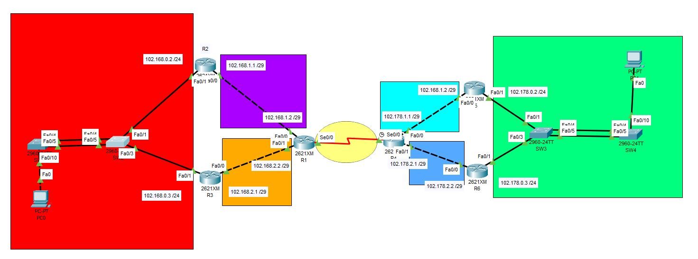

# Configuración de routers 

## Topologia

## Configuraciones routers
## R1

areas ip agregadas  

## R2
  protocolo HSRP  

areas de ip agregadas 

## R3
 Protocolo HSRP  

Areas de ip agregadas  
 

## R4
 

 

 rutas estaticas  

## R5

 protocolo HSRP  
 

 rutas estaticas  

## R6

 protocolo HSRP  

rutas estaticas  

# Configuración de swiches

## PAGP po1

## LACP po2

# Configuración de pc´s

## PC0
