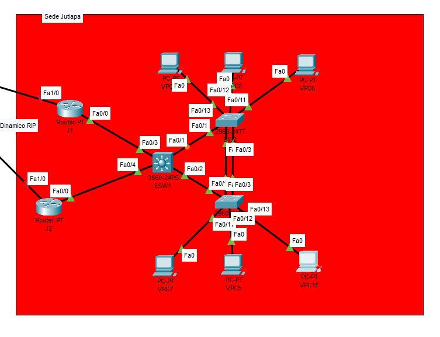
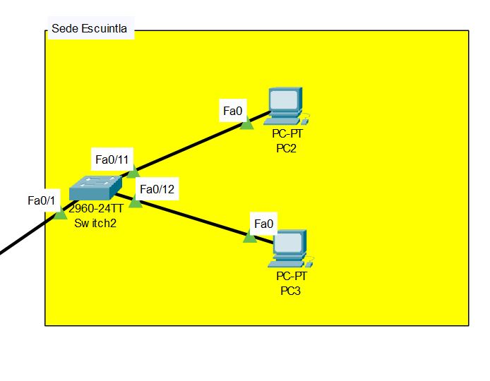
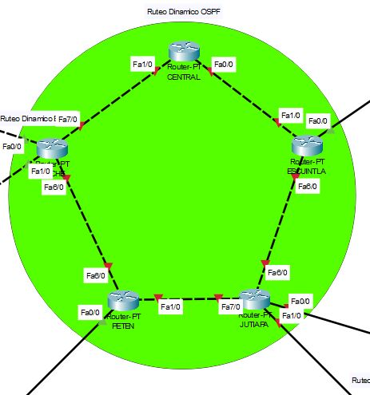
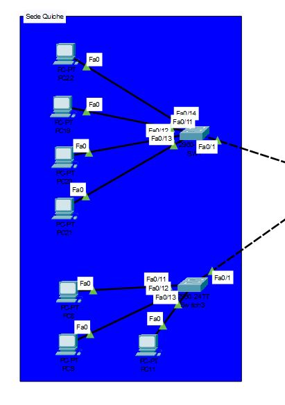
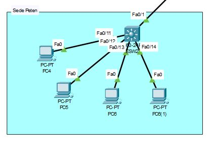

<h1 align="center"> PROYECTO 2 </h1>

<p align="center">
   
   </p>
<h3>UNIVERSIDAD DE SAN CARLOS DE GUATEMALA

LABORATORIO DE REDES DE COMPUTADORAS 1
PRIMER SEMESTRE 2024</h3>

<h1 align="center"> MANUAL TECNICO </h1>
El proyecto consistió en la implementación de redes para una empresa de venta de línea blanca y electrodomésticos, con el objetivo inicial de interconectar las sedes entre Jutiapa y la central de la ciudad capital. Se desarrolló una topología de red reducida para simular las interacciones entre los distintos componentes.

Para la sede de Jutiapa, se configuraron VLANs para cuatro departamentos distintos, cada uno con su segmentación de red. Se aplicó subnetting y se asignaron direcciones de red usando VLSM. Se configuraron interfaces virtuales para la puerta de acceso predeterminada de cada VLAN en el ESW1, se utilizó VTP para la propagación de las VLAN y RPVST para la prevención de bucles de red. Se configuró el protocolo LACP en SW2-SW3 y se estableció la comunicación entre los routers Jutiapa, J1 y J2 mediante HSRP, con IPs virtuales para la redundancia de primer salto.

Para la sede de Escuintla, se configuraron VLANs para dos departamentos, aplicando también subnetting y asignación de direcciones de red usando VLSM. Se utilizó VTP y RPVST, y se asignaron IPs a las VPCS.

Para la sede de Quiché, se aplicó conocimiento de subnetting y VLSM para determinar la máscara de subred adecuada, y se configuraron subinterfaces en el router Quiché para dar acceso a los equipos a la red de la empresa.

Para la sede de Petén, se configuraron interfaces virtuales para la puerta de acceso predeterminada de cada VLAN en el ESW2, y se aplicó subnetting y asignación de direcciones de red usando VLSM. Se utilizó VTP y RPVST, y se asignaron IPs a las VPCS.

Finalmente, se estableció el enrutamiento entre redes utilizando rutas estáticas para los routers frontera y ruteo dinámico OSPF para el Router Central hacia los demás routers, EIGRP para Sede Quiché y Petén, y RIP para Sede Jutiapa y Escuintla, asegurando la comunicación entre todos los equipos al finalizar la implementación.

## Sede Jutiapa
* **VLANS**

| Departamento         |Equipos    | VLAN | ID de red         | Host Disponibles | Primera IP    | ULtima IP     | IP Broadcast  | Mascara         | Slash    |
|----------------------|-----------|------|-------------------|------------------|---------------|---------------|---------------|-----------------|----------|
| Ventas               | 25        | 34   | 192.168.74.0      | 30               | 192.168.74.1  | 192.168.74.30 | 192.168.74.31 | 255.255.255.224 | /27      |
| Informatica          | 12        | 44   | 192.168.74.32     | 14               | 192.168.74.33 | 192.168.74.46 | 192.168.74.47 | 255.255.255.240 | /28      |
| RRHH                 | 10        | 14   | 192.168.74.48     | 14               | 192.168.74.49 | 192.168.74.62 | 192.168.74.63 | 255.255.255.240 | /28      |
| Contabilidad         | 4         | 24   | 192.168.74.64     | 6                | 192.168.74.64 | 192.168.74.70 | 192.168.74.71 | 255.255.255.248 | /29      |

* **HOSTS**

| Nombre | IP            | Departamento |
|--------|---------------|--------------|
| VPC5   | 192.168.74.66 | Contabilidad | 
| VPC6   | 192.168.74.51 | RRHH         |
| VPC7   | 192.168.74.50 | RRHH         |
| VPC8   | 192.168.74.67 | Contabilidad |
| VPC14  | 192.168.74.2  | Ventas       |
| VPC15  | 192.168.74.34 | Informatica  |



## Sede Escuintla
* **VLANS**

| Departamento         |Equipos    | VLAN | ID de red      | Host Disponibles | Primera IP    | ULtima IP     | IP Broadcast  | Mascara         | Slash    |
|----------------------|-----------|------|----------------|------------------|---------------|---------------|---------------|-----------------|----------|
| RRHH                 | 5         | 14   | 192.148.74.0   | 14               | 192.168.74.1  | 192.168.74.30 | 192.168.74.31 | 255.255.255.224 | /27      |
| Ventas               | 20        | 34   | 192.148.74.32  | 6                | 192.168.74.32 | 192.168.74.38 | 192.168.74.39 | 255.255.255.248 | /29      |

* **HOSTS**

| Nombre | IP            | Departamento |
|--------|-------------- |--------------|
| VPC2   | 192.148.74.34 | Ventas       |
| VPC3   | 192.148.74.2  | RRHH         |



## Core
| ID de Red |
|-----------|
|10.0.0.0 /24|


| Dispositivo | Interfaz | ID de Red | IP       | Mascara         | Slash | Wildcard |
|-------------|----------|-----------|----------|-----------------|-------|----------|
| Central     | 0/0      | 10.0.0.0  | 10.0.0.1 | 255.255.255.252 | /30   | 0.0.0.3  |
|             | 4/0      | 10.0.0.4  | 10.0.0.5 | 255.255.255.252 | /30   | 0.0.0.3  |
|             | 5/0      | 10.0.0.8  | 10.0.0.9 | 255.255.255.252 | /30   | 0.0.0.3  |
|             | 1/0      | 10.0.0.12 | 10.0.0.13| 255.255.255.252 | /30   | 0.0.0.3  |
| Escuintla   | 1/0      | 10.0.0.0  | 10.0.0.2 | 255.255.255.252 | /30   | 0.0.0.3  |
|             | 4/0      | 10.0.0.16 | 10.0.0.17| 255.255.255.252 | /30   | 0.0.0.3  |
|             | 5/0      | 10.0.0.20 | 10.0.0.21| 255.255.255.252 | /30   | 0.0.0.3  |
|             | 6/0      | 10.0.0.24 | 10.0.0.25| 255.255.255.252 | /30   | 0.0.0.3  |
| Jutiapa     | 6/0      | 10.0.0.24 | 10.0.0.26| 255.255.255.252 | /30   | 0.0.0.3  |
|             | 4/0      | 10.0.0.4  | 10.0.0.6 | 255.255.255.252 | /30   | 0.0.0.3  |
|             | 5/0      | 10.0.0.28 | 10.0.0.29| 255.255.255.252 | /30   | 0.0.0.3  |
|             | 7/0      | 10.0.0.32 | 10.0.0.33| 255.255.255.252 | /30   | 0.0.0.3  |
| Peten       | 1/0      | 10.0.0.32 | 10.0.0.34| 255.255.255.252 | /30   | 0.0.0.3  |
|             | 7/0      | 10.0.0.20 | 10.0.0.22| 255.255.255.252 | /30   | 0.0.0.3  |
|             | 4/0      | 10.0.0.8  | 10.0.0.10| 255.255.255.252 | /30   | 0.0.0.3  |
|             | 6/0      | 10.0.0.36 | 10.0.0.37| 255.255.255.252 | /30   | 0.0.0.3  |
| Quiche      | 7/0      | 10.0.0.12 | 10.0.0.14| 255.255.255.252 | /30   | 0.0.0.3  |
|             | 4/0      | 10.0.0.16 | 10.0.0.18| 255.255.255.252 | /30   | 0.0.0.3  |
|             | 5/0      | 10.0.0.28 | 10.0.0.30| 255.255.255.252 | /30   | 0.0.0.3  |
|             | 6/0      | 10.0.0.36 | 10.0.0.38| 255.255.255.252 | /30   | 0.0.0.3  |




## Sede Quiche
* **VLANS**

| Departamento         |Equipos    | VLAN | ID de red      | Host Disponibles | Primera IP     | ULtima IP      | IP Broadcast   | Mascara         | Slash    |
|----------------------|-----------|------|----------------|------------------|--------------- |----------------|--------------- |-----------------|----------|
| Ventas               | 36        | 34   | 192.178.74.0   | 62               | 192.168.74.1   | 192.168.74.62  | 192.168.74.63  | 255.255.255.192 | /26      |
| Informatica          | 21        | 44   | 192.178.74.64  | 30               | 192.168.74.65  | 192.168.74.94  | 192.168.74.95  | 255.255.255.224 | /27      |
| RRHH                 | 12        | 14   | 192.178.74.96  | 14               | 192.168.74.97  | 192.168.74.110 | 192.168.74.111 | 255.255.255.240 | /28      |
| Contabilidad         | 10        | 24   | 192.178.74.112 | 14               | 192.168.74.113 | 192.168.74.126 | 192.168.74.127 | 255.255.255.240 | /28      |

* **HOSTS**

| Nombre | IP             | Departamento |
|--------|--------------  |--------------|
| VPC8   | 192.178.74.2   | Ventas       |
| VPC9   | 192.178.74.66  | Informatica  |
| VPC11  | 192.178.74.3   | Ventas       |
| VPC19  | 192.178.74.114 | Contabilidad |
| VPC20  | 192.178.74.99  | RRHH         |
| VPC21  | 192.178.74.115 | Contabilidad |
| VPC22  | 192.178.74.98  | RRHH         |



## Sede Peten
* **VLANS**

| Departamento         |Equipos    | VLAN | ID de red      | Host Disponibles | Primera IP     | ULtima IP      | IP Broadcast   | Mascara         | Slash    |
|----------------------|-----------|------|----------------|------------------|--------------- |----------------|--------------- |-----------------|----------|
| Ventas               | 30        | 34   | 192.158.74.0   | 30               | 192.168.74.1   | 192.168.74.30  | 192.168.74.31  | 255.255.255.224 | /27      |
| Informatica          | 15        | 44   | 192.158.74.32  | 30               | 192.168.74.33  | 192.168.74.62  | 192.168.74.63  | 255.255.255.224 | /27      |
| RRHH                 | 10        | 14   | 192.158.74.64  | 14               | 192.168.74.65  | 192.168.74.78  | 192.168.74.79  | 255.255.255.240 | /28      |

* **HOSTS**

| Nombre | IP             | Departamento |
|--------|--------------  |--------------|
| PC4    | 192.158.74.66  | RRHH         |
| PC5    | 192.158.74.2   | Ventas       |
| PC6    | 192.158.74.34  | Informatica  |
| PC7    | 192.158.74.67  | RRHH         |



## :smile:Comandos Utilizados

**Acceder a configuraciones**
```python
enable
configure terminal
```

**Creación de Port-Channel**
```python
interface range f0/x-x
channel-group id mode ---

interface port-channel id
switchport mode trunk
show etherchannel
no auto-summary
```

**LACP**
```python
#SW3
mode active
#SW4
mode active
```

**HSRP activo**
```python
int f0/x
standby 10 ip <ip virtual>
standby 10 priority 150
standby 10 preempt
no shut
```

**HSRP standby**
```python
int fa0/x
standby 10 ip <ip virtual>
no shut
```

**Configuracion de Vlans**
```python
vlan 14
name RRHH
exit
```

**Acceso a Vlans**
```python
int fa0/x
switchport mode access
switchport access vlan x
```

**Modo troncal**
```python
int fa0/x
switchport mode trunk.
switchport trunk allowed vlan 1,14,24,34,44,1002-1005
```

**Configurar sub interfaz**
```python
int f0/0.14
encapsulation dot1q 14
ip address <ip> <mascara de subred>
no shutdown
exit 
```

**EIGRP**
```python
router eigrp 10

!definimos las redes conectadas a este router
network <id de red> <wildcard>
no auto-summary
```

**OSPF**
```python
router ospf 10

!definimos las redes conectadas a este router
network <id de red> <wildcard> area 0
```

**RIP**
```python
router rip
version 2

!definimos las redes conectadas a este router
network <id de red>
```

**Protocolo HSRP**
* J1


* J2


**PING Quiche a Peten**
* PC22 - PC9


## ✒️ Autores

* **Alvaro Esaú Arenas** - *Desarrollador* - [Contacto](https://github.com/esau-arenas).
* **Jorge Antonio Pérez** - *Desarrollador* - [Contacto](https://github.com/pereznator).